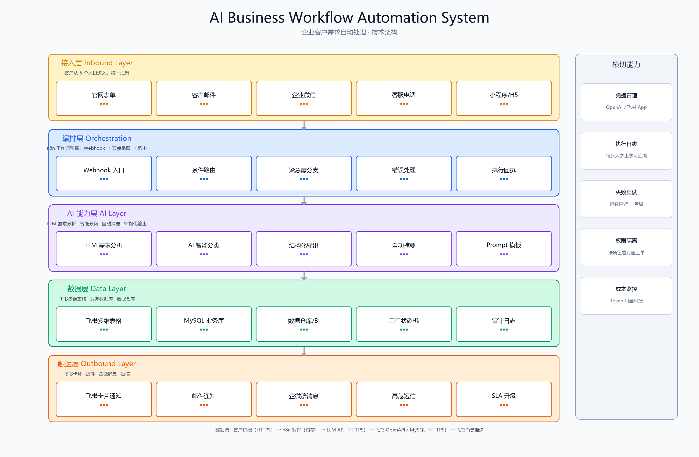

# AI Business Workflow Automation System

🔗 **[在线演示](https://xingjianlu573-dot.github.io/AI/)** ｜ **[GitHub 仓库](https://github.com/xingjianlu573-dot/AI)** ｜ [🇨🇳 国内部署指南](./README_CN.md)

> 一个面向企业场景的 **AI 工作流自动化** 案例：基于开源工作流引擎 [n8n](https://github.com/n8n-io/n8n)，把每天涌入的客户咨询、表单、邮件、文档 **自动接住 → 听懂 → 分类 → RAG 检索 → 落库 → SLA 路由 → 通知到人**。
> 开箱支持 **国产大模型切换**（DeepSeek / 通义千问 / 智谱 GLM / 月之暗面 Kimi）、**RAG 知识库增强**、**SLA 矩阵路由**、**国内一键 Docker 部署**，无需海外网络环境。

[🇨🇳 国内部署指南 README\_CN.md](./README_CN.md) · [业务价值说明](./docs/business-value.md) · [节点说明](./docs/nodes.md)


***

## ✨ 作品集亮点


| 能力               | 本项目落地                                         |
| ---------------- | --------------------------------------------- |
| **Workflow 自动化** | n8n 串联 Webhook → LLM → 分类 → RAG → 落库 → SLA → 通知，全链路无人工介入  |
| **RAG 知识库增强**    | 进线 → 检索知识库（Qdrant/pgvector/飞书知识库）→ 摘要引用政策片段，答案有依据不编造 |
| **Agent 式决策**    | LLM 节点输出意图 / 情绪 / 紧急度，由 SLA 矩阵决定响应时限与责任团队      |
| **SLA 矩阵路由**     | 7 分类 × 4 紧急度 = 28 组合 → P1~P4 时限 + 责任团队，通知卡片直接带 SLA |
| **结构化输出**        | 用 Structured Output 强约束模型，不让自由发挥污染工单数据        |
| **分温度模型策略**      | 分析/分类用 temperature 0.1 保证一致性，摘要用 0.4 更自然 |
| **错误处理与重试**      | 独立 Error Workflow 告警管理员，关键节点 retryOnFail       |
| **国产模型适配**       | 一套 OpenAI 兼容协议，通过环境变量切换 4 家国产模型               |
| **国内部署能力**       | docker-compose 一键起、Docker 镜像加速、npm 国内源、飞书原生集成 |


***

## 🏢 企业痛点

200 人 SaaS 公司每天从 5 个入口（官网表单 / 邮件 / 企微 / 客服电话 / 小程序）收到上百条客户进线。改造前：


* 客服早上开 5 个后台翻消息，漏看是常态；

* 凭经验分类，新员工常错派，客户被 "踢皮球"；

* 手动复制粘贴进 Excel，字段格式混乱，无法统计；

* 微信 @ 同事派单，人在开会就漏单；

* 夜间、周末、节假日无人响应，投诉发酵到社交平台。

**本项目把上面整条链路自动化成分钟级闭环。**


***

## 🔄 自动化流程


```
客户进线（表单/邮件/企微/电话/小程序）
            ↓
   ① Webhook 统一接收
            ↓
   ② LLM 需求分析（意图 / 情绪 / 紧急度 · 温度 0.1）
            ↓
   ③ AI 智能分类（售前/售后/技术/账单/合作/投诉/其他）
            ↓
   ④ 知识库检索（RAG）：检索相关政策片段
            ↓
   ⑤ 自动生成摘要（≤60 字 · 引用知识库 · 温度 0.4）
            ↓
   ⑥ 生成结构化工单
            ↓
   ⑦ SLA 矩阵（28 组合：P1~P4 时限 + 责任团队）
            ↓
   ⑧ 同步飞书多维表格 / MySQL（含 SLA 字段）
            ↓
   ⑨ 按紧急度飞书卡片通知负责人（红/橙/蓝 + SLA 徽章）
```


***

## 🏗️ 技术架构




五层结构：接入层 → n8n 编排层 → AI 能力层 → 数据层 → 触达层，外加凭据 / 日志 / 重试 / 权限 / 成本五条横切能力。

**技术栈**：


* **工作流引擎**：n8n（自托管，AGPL）

* **大模型**：OpenAI 兼容协议，默认 DeepSeek，可切通义 / 智谱 / Kimi/OpenAI

* **数据存储**：飞书多维表格（业务看板）+ MySQL（系统记录）

* **通知通道**：飞书开放平台 IM 卡片

* **前端表单**：零依赖单文件 HTML


***

## 📁 仓库结构


```
.
├── README.md                  # 本文件（作品集主页）
├── README_CN.md               # 国内部署完整指南
├── .env.example               # 所有环境变量（含国产模型切换 + RAG）
├── docker-compose.yml         # 一键起 n8n
├── index.html                 # 在线演示页（GitHub Pages 根路径）
├── workflows/
│   ├── customer-inbox-ai-automation.json   # 主工作流：9 阶段（含 RAG + SLA）
│   └── error-handler.json     # 错误处理工作流（异常自动告警管理员）
├── demo/
│   └── index.html             # 演示页源文件（与根 index.html 同步）
├── form/
│   └── index.html             # 客户进线表单（连真实 Webhook 用）
├── simulation/
│   ├── sample-tickets.json    # 25 条标注好的模拟工单
│   └── knowledge-base.md      # 模拟知识库（RAG 检索源，可导入向量库）
├── scripts/
│   └── test_ai_provider.py    # AI 接口连通性测试
├── assets/
│   └── workflow-overview.png
└── docs/
    ├── architecture.png
    ├── nodes.md
    ├── business-value.md
    └── test-report.md         # 测试报告
```


***

## 🚀 快速开始（国内用户看这里 → [README\_CN.md](./README_CN.md)）


```
cp .env.example .env          # 填一个国产模型 Key + 飞书凭据
docker compose up -d          # 一键起 n8n（建议先配国内镜像加速）
# 打开 http://localhost:5678，工作流已自动导入，激活即可
```


***

## 💰 业务收益


| 指标        | 改造前            | 改造后      |
| --------- | -------------- | -------- |
| 客户首次响应    | 数小时～1 工作日      | < 1 分钟   |
| 工单错派率     | 15%\~25%       | < 5%     |
| 高危工单隔夜未处理 | 每周 3\~5 起      | ≈ 0      |
| 人工分拣 / 录入 | 每人每天 1.5\~2 小时 | ≈ 0      |
| 数据完整率     | 字段缺失、格式混乱      | 100% 结构化 |


***

## 📜 License

MIT