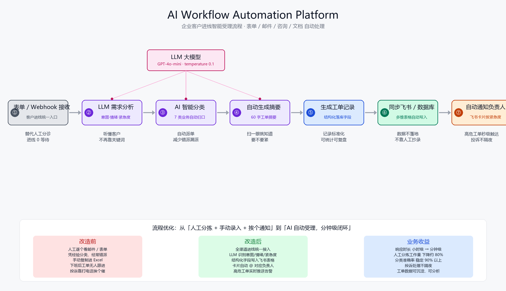

# 节点说明

> 对应工作流文件：`workflows/customer-inbox-ai-automation.json`
> 本文不只讲"这个节点怎么配"，更讲"这个节点替代了原来哪个人工动作、给业务带来什么改变"。

## 一图总览

---

## 节点清单

### ① 表单 / Webhook 接收（Webhook Trigger）

- **替代的人工动作**：客服每天早上去邮箱、企业微信后台、官网留言板挨个翻，把分散的咨询手动抄到一张 Excel 里。
- **现在做什么**：对外暴露一个统一入口 `POST /webhook/customer-inbox`。官网表单、企业微信机器人、邮件转发、第三方 SaaS 都打到同一个地址。
- **业务意义**：把"散落在 5 个地方的客户声音"收拢成一条流水线，不再漏看、不再重复登记。
- **关键配置**：`responseMode=responseNode`，处理完再回执，客户能立刻拿到受理编号。

### ② LLM 需求分析（Chain LLM）

- **替代的人工动作**：客服读完一大段客户留言，在脑子里判断"这是要退款？要退货？还是问发票？客户急不急？生气没生气？"
- **现在做什么**：把客户原话喂给大模型，强制输出结构化字段：
  - `intent`：一句话说清客户到底要什么
  - `sentiment`：情绪（positive / neutral / negative / angry）
  - `urgency`：紧急度（low / medium / high / critical）
  - `expectedAction`：希望企业下一步做什么
- **业务意义**：第一次让"客户的情绪和紧急度"变成可被系统处理的数据，而不是靠客服个人经验。
- **调优点**：`temperature=0.1`，输出稳定，适合生产。

### ③ AI 智能分类（Chain LLM + Structured Output）

- **替代的人工动作**：前台/值班同事凭印象把工单分给销售、售后、技术、财务、商务——分错了客户就要被转两三次。
- **现在做什么**：LLM 从 7 个预置分类里选一个：
  `sales_inquiry`（售前咨询）/ `after_sales`（售后退换）/ `tech_support`（技术支持）/ `billing`（账单付款）/ `partnership`（商务合作）/ `complaint`（投诉）/ `other`（其他）。
- **业务意义**：
  - 新员工不用再背"什么单子该找谁"；
  - 错派率明显下降，客户少被"踢皮球"；
  - 每个分类的数据都能单独统计，管理者知道哪个部门工单最多。
- **为什么要单独一个节点而不是和②合并**：分析和分类是两件事——分析管"客户怎么了"，分类管"这事归谁管"。拆开后分类规则可以独立调整，不影响分析质量。

### ④ 自动生成摘要（Chain LLM）

- **替代的人工动作**：负责人被 @ 之后还要自己点开原文、读几百字客户描述，才能判断要不要接。
- **现在做什么**：把 ②③ 的结果喂回去，生成一段不超过 60 字的工单摘要。
- **业务意义**：负责人在飞书通知列表里**扫一眼卡片就知道要不要立刻处理**，不用每条都点进去读长文。这是"通知有没有人看"的关键。

### ⑤ 生成结构化工单记录（Set）

- **替代的人工动作**：把客户名、联系方式、问题描述手动敲进 Excel / 工单系统，字段格式还五花八门。
- **现在做什么**：把前面所有节点的结果打包成一条标准工单：工单号（`TK-日期-流水`）、客户、联系方式、来源、分类、情绪、紧急度、摘要、原文、状态、创建时间。
- **业务意义**：从此每一条客户进线都是**同构、可查询、可统计**的记录，为后续报表、SLA 考核、AI 复盘打地基。

### ⑥ 同步飞书 / 数据库（HTTP Request → 飞书多维表格）

- **替代的人工动作**：客服把刚录好的 Excel，再复制粘贴到公司内部系统；或者下班前统一"补录"。
- **现在做什么**：工单一生成，立刻调用飞书多维表格 OpenAPI 写入一行；如有需要，同一个分支可以并行写业务数据库 / CRM。
- **业务意义**：
  - 数据实时落地，不再有"昨晚的工单今早才录"的时间差；
  - 飞书表格就是一张共享看板，全员看到同一份数据，不用来回发截图。

### ⑦ 自动通知负责人（HTTP Request → 飞书消息卡片）

- **替代的人工动作**：班长看到单子后，微信/电话挨个找对应同事；紧急的事常常因为人在开会而被耽误。
- **现在做什么**：按紧急度路由后，给负责人发一张飞书交互卡片：
  - 红色 = critical（投诉、舆情级）
  - 橙色 = high
  - 蓝色 = 普通
  - 卡片里直接带：分类、紧急度、客户联系方式、AI 摘要、原文链接。
- **业务意义**：**高危工单从"被发现"到"触达负责人"是秒级**，而不是等上班、等开会结束。客户投诉不再过夜。

---

## 为什么要这样拆节点，而不是一个大 Prompt 全包

很多团队第一版会写一个超长 Prompt 让模型一次性输出所有字段。本工作流刻意拆成 **分析 → 分类 → 摘要** 三段，原因是：

| 做法 | 优点 | 缺点 |
|---|---|---|
| 一个大 Prompt 全搞定 | 省一次模型调用 | 改分类规则要重跑全部；出错时不知道哪段错 |
| **三段式（本方案）** | 每段职责单一、可独立调 Prompt、可单独替换模型、可单独监控准确率 | 多两次调用，成本可忽略 |

对企业来说，**可维护性 > 省几次 token**。分类规则下个月要加新类目，只动 ③；想换国产模型，只动上面那个 Chat Model 节点。

---

## 所需外部配置

在 n8n 中导入工作流后，需在 **Credentials / 环境变量** 里配好：

| 变量名 | 用途 |
|---|---|
| `OPENAI_API_KEY`（在 OpenAI 凭据里配） | 给 ②③④ 三个 LLM 节点用 |
| `FEISHU_BITABLE_APP_TOKEN` | ⑥ 写多维表格 |
| `FEISHU_BITABLE_TABLE_ID` | ⑥ 写多维表格 |
| `FEISHU_OWNER_USER_ID` | ⑦ 通知的默认负责人 |
| 飞书 `tenant_access_token` 获取方式 | 建议加一个前置 HTTP 节点自动刷新，避免手动维护 |

> 飞书应用需要开通权限：`bitable:app`（多维表格读写）、`im:message`（发消息）。
